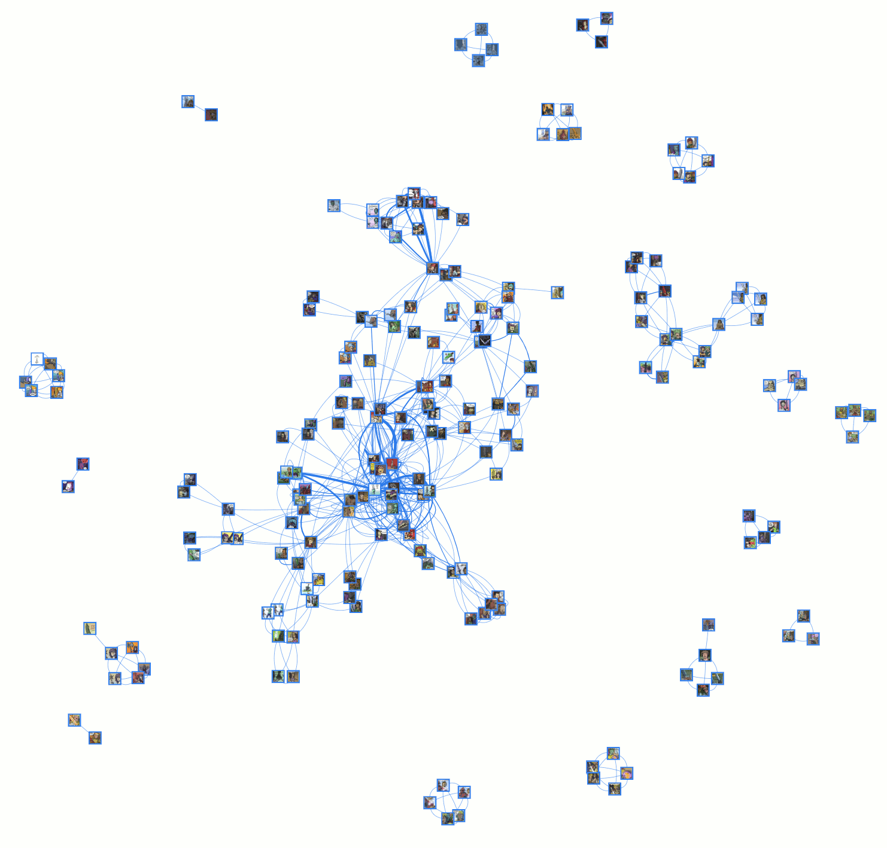

# swords-comic-characters-visualization
This is a data visualization of characters from the [internet comic Swords](https://www.reddit.com/r/SwordsComic/). Each character is represted as a node in a graph and they are connected to other characters that they appeared in comics with. Additionally you can search for or click on a character to see more information about them. You can see the [visualization here](https://excaliburzero.github.io/swords-comic-characters-visualization/).

This visualization was developed using a mix of `vis.js`, `jQuery`, Semantic UI, and `d3`.

Big thanks to Matthew Wills for making such an amazing comic!

## Data
This data visualization is powered by 3 `.csv` files with information gathered on the comic.

* `Swords Comic - Appearances.csv` - This file contains information on all of the appearances of characters in comics. It includes the comic number, the characters that appeared in it, and to what degree the characters appeared in it (appeared, mentioned, etc.).
* `Swords Comic - Characters.csv` - This file contains information on all of the characters that have appeared in the comic. It includes their names (some guessed) and alternate names and appearances.
* `Swords Comic - Comics.csv` - This file contains a list of all of the comics and links to images of them.

## Contributing
Did I get a character's name wrong? Was there a character in the background a comic that is really hard to find? Has a new comic come out?

Feel free to make a pull request to make changes or fixes to the data. Any help is appreciated!

## Licensing
All of the code for this data visualization is available under the MIT license.

All of the images of characters from the comic belong to Matthew Wills, the author of Swords.
